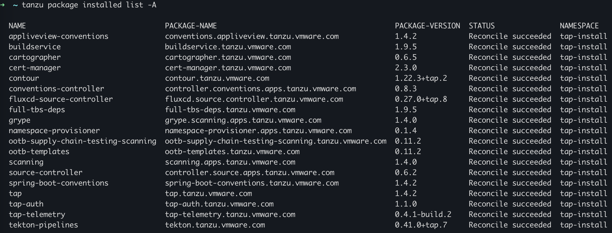

# Tanzu Application Platform (TAP) Build Cluster 설치
본 가이드는 쿠버네티스 클러스터에 build 프로파일을 가지는 TAP 버전 1.4.2를 설치하는 방법에 대해 설명합니다. TKG (Tanzu Kubernetes Grid)를 기준으로 작성되었으나, TAP를 지원하는 다른 쿠버네티스 클러스터에서도 동일한 설정을 지원합니다.
> **_NOTE:_** build 클러스터를 설치하기 위해서는 사전에 full 클러스터(정확히는 view 클러스터)가 설치되어 있어야 합니다.

## 1. 설치 환경 구성
### 1) 환경 변수
설치를 위한 환경 변수를 다음과 같이 설정합니다. 실습자가 가지고 있는 레지스트리 설정에 맞는 정보를 입력합니다.   
```
export INSTALL_REGISTRY_USERNAME=<사설 레지스트리 접속 ID>
export INSTALL_REGISTRY_PASSWORD=<사설 레지스트리 접속 비밀번호>
export INSTALL_REGISTRY_HOSTNAME=<사설 레지스트리 접속 FQDN>
export TAP_VERSION=1.4.2
export VERSION=1.9.5
```
> **_NOTE:_** 위 환경변수의 버전은 빌드 서비스의 버전을 의미합니다. TAP 패키지와 함께 설치된 빌드 서비스 버전을 참고하여 지정합니다. 여기서는 TAP 1.4.2 버전을 기준으로 빌드서비스 1.9.5를 사용하기 때문에 이 버전으로 지정하였습니다.

### 2) 이미지 레파지토리 구성
TAP에서 사용하는 이미지 레파지토리 주소는 다음과 같습니다.
|레지스트리 주소|설명|
|------|---|
|$INSTALL_REGISTRY_HOSTNAME/tap/tap-packages|TAP 설치 파일|
|$INSTALL_REGISTRY_HOSTNAME/tbs/build-service|빌드 서비스 이미지 파일|
|$INSTALL_REGISTRY_HOSTNAME/tap/full-tbs-deps-package-repo|빌드 서비스 디펜던시 설치 파일|
|$INSTALL_REGISTRY_HOSTNAME/tap/supply-chain|Supply Chain에서 사용, 빌드된 앱 이미지들이 여기에 저장됨|

## 2. 레지스트리 로그인
설치를 진행할 Local PC에서 docker CLI를 이용하여 레지스트리에 로그인 합니다. 
```cmd
docker login ${INSTALL_REGISTRY_HOSTNAME}
```

## 3. TAP 설치

### 1) 네임스페이스 생성
TAP 설치를 위해 클러스터에 접속 후 다음 명령어를 사용하여 네임스페이스를 생성합니다.
```cmd
kubectl create ns tap-install
```

### 2) TAP 설치를 위한 레지스트리 및 패키지 추가
#### a. 레지스트리 시크릿 추가
```cmd
tanzu secret registry add tap-registry --username ${INSTALL_REGISTRY_USERNAME} --password ${INSTALL_REGISTRY_PASSWORD} --server ${INSTALL_REGISTRY_HOSTNAME} --export-to-all-namespaces --yes --namespace tap-install 
```

#### b. 패키지 레지스트리 추가
```cmd
tanzu package repository add tanzu-tap-repository --url ${INSTALL_REGISTRY_HOSTNAME}/tanzu-application-platform/tap-packages:${TAP_VERSION} --namespace tap-install
```

#### c. 패키지 레지스트리 확인
설치된 패키지 레지스트리의 status를 확인합니다. Reconcile succeed를 확인 후 다음 단계로 넘어갑니다.
```cmd
tanzu package repository get tanzu-tap-repository --namespace tap-install
```

#### d. 설치 가능한 패키지 목록 확인
```cmd
tanzu package available list --namespace tap-install 
```

#### e. TAP 패키지와 함께 설치할 수 있는 패키지 및 버전 확인
```cmd
tanzu package available get tap.tanzu.vmware.com/${TAP_VERSION} --values-schema --namespace tap-install 
```

### 3) 빌드 서비스를 위한 레지스트리 및 패키지 추가

#### a. 패키지 레지스트리 추가
```cmd
tanzu package repository add tbs-full-deps-repository --url ${INSTALL_REGISTRY_HOSTNAME}/tanzu-application-platform/full-tbs-deps-package-repo:$VERSION --namespace tap-install
```

#### b. 패키지 레지스트리 확인
```
tanzu package repository get tbs-full-deps-repository --namespace tap-install
```

### 4) TAP 설치를 위한 YAML 파일 생성
build 프로파일을 가지는 TAP를 설치하기 위해 이 [YAML 파일 템플릿](./tap-values.yaml)을 참고하여 변수를 실습자의 환경에 맞게 수정하고, tap-values.yaml 파일을 생성합니다.

#### a. 템플릿에 사용된 관련 변수 정보
|변수명|설명|
|---|---|
|TAP_INGRESS_DOMAIN|TAP에서 사용할 Ingress Domain의 FQDN|

#### b. 인증서 추가
shared.ca_cert_data에 metadata-store.${TAP_INGRESS_DOMAIN} 도메인에 대한 인증서를 추가합니다. 

### 5) TAP 설치
#### a. 스캔 템플릿 오버레이
Grype가 자체 서명된 인증서를 사용하여 사설 레지스트리에 연결하지 못하게 하는 문제에 대한 워크어라운드 입니다. 이미지 레파지토리에 공용 인증서 사용 시 생략 가능합니다.
```
kubectl apply -f build-cluster/overlay-cert-injection-webhook-scantemplates.yaml 
```

#### b. metadata store 시크릿 생성
##### 네임스페이스 생성
메타데이터 시크릿을 저장할 네임스페이스를 생성합니다.
```
kubectl create ns metadata-store-secrets 
```

##### CA_CERT 값 및 AUTH_TOKEN 구하기
full 클러스터에서 다음 명령어를 수행하여 CA_CERT 값 및 AUTH_TOKEN 값을 획득합니다.
```
export CA_CERT=$(kubectl -n metadata-store get secret ingress-cert -o jsonpath="{.data.ca\.crt}") 

export AUTH_TOKEN=$(kubectl get secret -n metadata-store metadata-store-read-write-client -otemplate='{{.data.token}}')
```
##### 획득한 CA_CERT 값 및 AUTH_TOKEN 값으로 시크릿 생성
[시크릿 파일 템플릿](./metadata-store-secrets.yaml)을 참조하여 metadata-store-secrets.yaml 파일을 생성합니다. 이후, 윗 단계에서 획득한 값을 치환한 후 시크릿을 생성합니다.
```
kubectl apply -f metadata-store-secrets.yaml
```

#### c. TAP 설치
다음 명령어를 사용하여 TAP 패키지를 설치합니다. tap-values.yaml 파일은 위의 4)번 단계에서 생성한 파일입니다.
```
tanzu package install tap -p tap.tanzu.vmware.com -v $TAP_VERSION --values-file tap-values.yaml -n tap-install
```

만일 TAP 패키지의 수정이 필요하면 다음 명령어를 사용하여 패키지를 수정합니다.
```
tanzu package installed update tap -p tap.tanzu.vmware.com -v $TAP_VERSION --values-file tap-values.yaml -n tap-install
```

### 6) TAP 설치 확인
다음 명령어를 사용하여 TAP 패키지 설치를 확인합니다.
```
tanzu package installed list -n tap-install
```

### 7) 빌드 서비스 디펜던시 설치
다음 명령어를 사용하여 빌드 서비스 디펜던시 패키지를 설치합니다.
```
$ tanzu package install full-tbs-deps -p full-tbs-deps.tanzu.vmware.com -v $VERSION -n tap-install
```

### 8) TAP 및 빌드 서비스 디펜던시 설치 확인
```
tanzu package installed list -n tap-install
```
설치가 정상적으로 완료되었으면 다음과 같이 패키지 목록이 나타나고, Status에 "Reconcile Succeeded"를 확인할 수 있습니다.


## 참고 문서
멀티 클러스터로 구성된 환경의 TAP 설치는 다음 [링크](https://docs.vmware.com/en/VMware-Tanzu-Application-Platform/1.4/tap/multicluster-installing-multicluster.html)를 참고하시기 바랍니다. 
