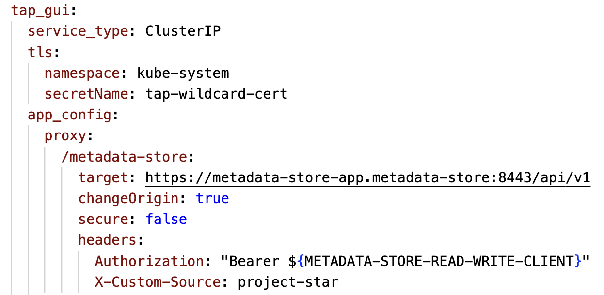

# Tanzu Application Platform (TAP) Full Cluster 설치
본 가이드는 쿠버네티스 클러스터에 full 프로파일을 가지는 TAP 버전 1.4.2를 설치하는 방법에 대해 설명합니다. 멀티 클러스터 환경에서 최소한의 쿠버네티스 클러스터 사용을 위해 개발자의 inner loop 환경을 제공하기 위한 iterate 클러스터와 TAP GUI를 위한 view 클러스터를 통합해서 구성하기 위하여 full 클러스터를 사용합니다. TKG (Tanzu Kubernetes Grid)를 기준으로 작성되었으나, TAP를 지원하는 다른 쿠버네티스 클러스터에서도 동일한 설정을 지원합니다.

full 클러스터에 배포된 TAP GUI는 다음 URL로 접속할 수 있습니다.
```
https://tap-gui.${TAP_INGRESS_DOMAIN}
```
full 클러스터에 배포된 워크로드는 기본적으로 다음 URL로 접속됩니다.
```
http(s)://${APPLICATION_NAME}.${TAP_INGRESS_DOMAIN}
```

## 1. 설치 환경 구성
### 1) 환경 변수
설치를 위한 환경 변수를 다음과 같이 설정합니다. 실습자가 가지고 있는 레지스트리 설정에 맞는 정보를 입력합니다.   
```
export INSTALL_REGISTRY_USERNAME=<사설 레지스트리 접속 ID>
export INSTALL_REGISTRY_PASSWORD=<사설 레지스트리 접속 비밀번호>
export INSTALL_REGISTRY_HOSTNAME=<사설 레지스트리 접속 FQDN>
export TAP_VERSION=1.4.2
export INSTALL_REPO=tanzu-application-platform
export VERSION=1.9.5
```
> **_NOTE:_** 위 환경변수의 버전은 빌드 서비스의 버전을 의미합니다. TAP 패키지와 함께 설치된 빌드 서비스 버전을 참고하여 지정합니다. 여기서는 TAP 1.4.2 버전을 기준으로 빌드서비스 1.9.5를 사용하기 때문에 이 버전으로 지정하였습니다.

### 2) 이미지 레파지토리 구성
TAP에서 사용하는 이미지 레파지토리 주소는 다음과 같습니다.
|레지스트리 주소|설명|
|------|---|
|$INSTALL_REGISTRY_HOSTNAME/tap/tap-packages|TAP 설치 파일|
|$INSTALL_REGISTRY_HOSTNAME/tbs/build-service|빌드 서비스 이미지 파일|
|$INSTALL_REGISTRY_HOSTNAME/tap/full-tbs-deps-package-repo|빌드 서비스 디펜던시 설치 파일|
|$INSTALL_REGISTRY_HOSTNAME/tap/supply-chain|Supply Chain에서 사용, 빌드된 앱 이미지들이 여기에 저장됨|

## 2. 레지스트리 로그인
설치를 진행할 Local PC에서 docker CLI를 이용하여 레지스트리에 로그인 합니다. 
```cmd
$ docker login ${INSTALL_REGISTRY_HOSTNAME}
```

## 3. TAP 설치

### 1) 네임스페이스 생성
TAP 설치를 위해 클러스터에 접속 후 다음 명령어를 사용하여 네임스페이스를 생성합니다.
```cmd
kubectl create ns tap-install
```

### 2) TAP 설치를 위한 레지스트리 및 패키지 추가


#### a. tap-packages을 실습자의 환경의 image registry로 copy
```cmd
imgpkg copy -b registry.tanzu.vmware.com/tanzu-application-platform/tap-packages:${TAP_VERSION} --to-repo ${INSTALL_REGISTRY_HOSTNAME}/${INSTALL_REPO}/tap-packages
```


#### b. 레지스트리 시크릿 추가
```cmd
tanzu secret registry add tap-registry --username ${INSTALL_REGISTRY_USERNAME} --password ${INSTALL_REGISTRY_PASSWORD} --server ${INSTALL_REGISTRY_HOSTNAME} --export-to-all-namespaces --yes --namespace tap-install 
```

#### c. 패키지 레지스트리 추가
```cmd
tanzu package repository add tanzu-tap-repository --url ${INSTALL_REGISTRY_HOSTNAME}/${INSTALL_REPO}/tap-packages:${TAP_VERSION} --namespace tap-install
```

#### d. 패키지 레지스트리 확인
설치된 패키지 레지스트리의 status를 확인합니다. Reconcile succeed를 확인 후 다음 단계로 넘어갑니다.
```cmd
tanzu package repository get tanzu-tap-repository --namespace tap-install
```

#### e. 설치 가능한 패키지 목록 확인
```cmd
tanzu package available list --namespace tap-install 
```

#### f. TAP 패키지와 함께 설치할 수 있는 패키지 및 버전 확인
```cmd
tanzu package available get tap.tanzu.vmware.com/${TAP_VERSION} --values-schema --namespace tap-install 
```

### 3) 빌드 서비스를 위한 레지스트리 및 패키지 추가

#### a. Tanzu Build Service full dependencies package을 실습자의 환경의 image registry로 copy
```cmd
imgpkg copy -b registry.tanzu.vmware.com/build-service/full-tbs-deps-package-repo:$VERSION --to-repo ${INSTALL_REGISTRY_HOSTNAME}/${INSTALL_REPO}/full-tbs-deps-package-repo
```

#### b. 패키지 레지스트리 추가
```cmd
tanzu package repository add tbs-full-deps-repository --url ${INSTALL_REGISTRY_HOSTNAME}/tanzu-application-platform/full-tbs-deps-package-repo:$VERSION --namespace tap-install
```

#### c. 패키지 레지스트리 확인
```cmd
tanzu package repository get tbs-full-deps-repository --namespace tap-install
```

### 4) TAP 설치를 위한 YAML 파일 생성
full 프로파일을 가지는 TAP를 설치하기 위해 이 [YAML 파일 템플릿](./tap-values.yaml)을 참고하여 변수를 실습자의 환경에 맞게 수정하고, tap-values.yaml 파일을 생성합니다.

#### a. 템플릿에 사용된 관련 변수 정보
|변수명|설명|
|---|---|
|TAP_INGRESS_DOMAIN|TAP에서 사용할 Ingress Domain의 FQDN|

### 5) TAP 설치를 위한 환경 구성
#### a. 와일드카드 인증서 생성 - TODO
앱에서 사용할 TLS TLS 인증서 및 키를 secret으로 생성합니다.
[시크릿 파일 템플릿](./tap-gui-tls-cert.yaml)을 참고하여 tap-gui-tls-cert.yaml 파일을 생성하고, 시크릿을 생성합니다.
tap-wildcard-cert
```
$ k create ns tap-gui 

// create tls cert for *.view.tap.tanzukorea.xyz 

$ k apply -f view-cluster/tap-gui-tls-cert.yaml 
```

#### b. TAP GUI Database 설정 
이 부분은 현재 설치 단계에서는 생략하고, 이후 실습에서 진행할 예정입니다. 

#### c. 멀티클러스터 리소스 조회 권한 부여
TAP GUI에서 build 클러스터와 run 클러스터의 리소스들을 접속하기 위한 권한을 부여합니다. [rbac 파일 템플릿](./tap-gui-viewer-service-account-rbac.yaml)을 참고하여 build 클러스터와 run 클러스터에 각각 접속하여 다음 명령어를 수행합니다.
```cmd
kubectl apply -f tap-gui-viewer-service-account-rbac.yaml 
```

#### d. Metadata Store를 위한 인증 설정
Metadata Store를 위한 인증 설정을 위해 네임스페이스를 생성합니다.
```cmd
kubectl create ns metadata-store 
```

쿠버네티스 1.24 이후 버전인 경우 [tap-gui-metadata-store-rbac.yaml](./tap-gui-metadata-store-rbac.yaml) 파일을 생성하고 다음 명령어로 롤을 생성합니다. (2023년 3월 기준 최신 버전인 TKG 1.6.1의 최신 쿠버네티스 버전은 1.23입니다.)
```cmd
kubectl apply -f tap-gui-metadata-store-rbac.yaml 
```

tap-vaules.yaml 파일의 METADATA-STORE-READ-WRITE-CLIENT 부분에 아래 명령어를 수행하여 Metadata Store의 시크릿 정보를 획득하여 값을 변경한다. 
```cmd
kubectl get secret metadata-store-read-write-client -n metadata-store -o jsonpath="{.data.token}" | base64 -d 
```


아래 명령어를 수행하여 tap-values.yaml 파일의 해당 변수값을 변경합니다.
* build 클러스터에서 BUILD_CLUSTER_URL 변수 값 획득
  ```cmd
  BUILD_CLUSTER_URL=$(kubectl config view --minify -o jsonpath='{.clusters[0].cluster.server}') 
  ```
* build 클러스터에서 BUILD_CLUSTER_TOKEN 변수 값 획득
  ```cmd
  BUILD_CLUSTER_TOKEN=$(kubectl -n tap-gui get secret $(kubectl -n tap-gui get sa tap-gui-viewer -o=json | jq -r '.secrets[0].name') -o=json | jq -r '.data["token"]' | base64 --decode) 
  ```
  쿠버네티스 버전이 1.24 이상이라면 아래 명령어로 변수 값을 획득합니다.
  ```cmd
  BUILD_CLUSTER_TOKEN=$(kubectl -n tap-gui get secret tap-gui-viewer -o=json | jq -r '.data["token"]' | base64 --decode)
  ```
* run 클러스터에서 RUN_CLUSTER_URL 변수 값 획득
  ```cmd
  RUN_CLUSTER_URL=$(kubectl config view --minify -o jsonpath='{.clusters[0].cluster.server
* run 클러스터에서 RUN_CLUSTER_TOKEN 변수 값 획득
  ```cmd
  RUN_CLUSTER_TOKEN=$(kubectl -n tap-gui get secret $(kubectl -n tap-gui get sa tap-gui-viewer -o=json | jq -r '.secrets[0].name') -o=json | jq -r '.data["token"]' | base64 --decode) 
  ```
  쿠버네티스 버전이 1.24 이상이라면 아래 명령어로 변수 값을 획득합니다.
  ```cmd
  RUN_CLUSTER_TOKEN=$(kubectl -n tap-gui get secret tap-gui-viewer -o=json | jq -r '.data["token"]' | base64 --decode)
  ```

#### e. Ingress Domain의 인증서 복사
shared.ca_cert_data에  Ingress Domain의 인증서를 지정합니다.

### 6) TAP 설치
다음 명령어를 사용하여 TAP 패키지를 설치합니다. tap-values.yaml 파일은 위의 4)번 단계에서 생성한 파일입니다.
```cmd
tanzu package install tap -p tap.tanzu.vmware.com -v $TAP_VERSION --values-file tap-values.yaml -n tap-install
```

만일 TAP 패키지의 수정이 필요하면 다음 명령어를 사용하여 패키지를 수정합니다.
```cmd
tanzu package installed update tap -p tap.tanzu.vmware.com -v $TAP_VERSION --values-file tap-values.yaml -n tap-install
```

### 7) TAP 설치 확인
다음 명령어를 사용하여 TAP 패키지 설치를 확인합니다.
```cmd
tanzu package installed list -n tap-install
```

### 8) 빌드 서비스 디펜던시 설치
다음 명령어를 사용하여 빌드 서비스 디펜던시 패키지를 설치합니다.
```cmd
tanzu package install full-tbs-deps -p full-tbs-deps.tanzu.vmware.com -v $VERSION -n tap-install
```

### 9) TAP 및 빌드 서비스 디펜던시 설치 확인
```cmd
tanzu package installed list -n tap-install
```
설치가 정상적으로 완료되었으면 다음과 같이 패키지 목록이 나타나고, Status에 "Reconcile Succeeded"를 확인할 수 있습니다.


## 4. TAP GUI 접속 확인
설치가 완료 되었으면, TAP GUI 콘솔에 접속하여 설치가 정상적으로 이루어 졌는지를 확인해 봅니다. 위의 설치 과정에서 인그레스 도메인을 변경하였다면, 그 도메인에 맞게 접속해 봅니다.
```
https://tap-gui.${TAP_INGRESS_DOMAIN}
```

## 참고 문서
멀티 클러스터로 구성된 환경의 TAP 설치는 다음 [링크](https://docs.vmware.com/en/VMware-Tanzu-Application-Platform/1.4/tap/multicluster-installing-multicluster.html)를 참고하시기 바랍니다. 
