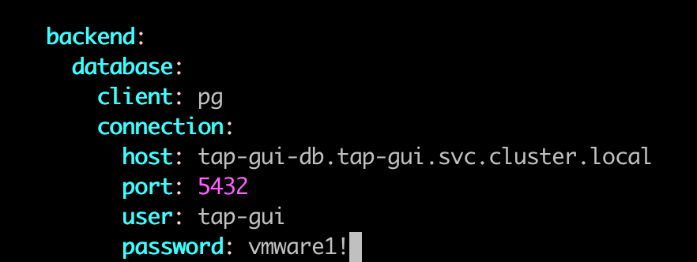

## Tanzu Application Platform GUI 데이터베이스 구성

TAP GUI catalog는 catalog를 저장하기 위한 두 가지 접근 방식을 허용합니다.

* In-memory database(default option): 메모리 내 데이터베이스를 사용하며 테스트 및 개발 시나리오에만 적합합니다. 메모리 내 데이터베이스는 tap-values.yaml로 작성한 Git URL에서 카탈로그 데이터를 읽습니다. 
이 데이터는 임시 데이터입니다. tap-gui namespace pod recrated 될때 git catalog 위치에서 다시 데이터를 읽어 와서 생성하도록 합니다.
이로 인해 UI 콘솔에서 엔티티를 수동으로 등록 후 메모리 내에 데이터베이스가 재구성될떄(namespace pod가 recrated) 테이터가 손실이 됩니다.


* PostgreSQL database: Tanzu Application Platform 패키지 외부에 존재하는 SQL 데이터베이스. PostgreSQL를 사용하며, 데이터베이스는 Git 위치와 UI 수동 엔티티 등록의 모든 카탈로그 데이터를 영구적으로 저장합니다.


### 1.PostgreSQL database 구성
tap-values.yaml edit 합니다. 아래와 같이 tap-values.yaml에 있는 values을 apply 합니다.


```cmd
# ... existing tap-values.yaml above
tap_gui:
 # ... existing tap_gui values
 app_config:
 backend:
 database:
 client: pg
 connection:
 host: PG-SQL-HOSTNAME
 port: 5432
 user: PG-SQL-USERNAME
 password: PG-SQL-PASSWORD
 ssl: {rejectUnauthorized: false} # Set to true if using SSL
```

* PG-SQL-HOSTNAME is the host name of your PostgreSQL database
* PG-SQL-USERNAME is the user name of your PostgreSQL database
* PG-SQL-PASSWORD is the password of your PostgreSQL database





### 2. package profile 업데이트 
수정된 값으로 Tanzu Application Platform을 업데이트하여 새 구성을 적용할 수 있습니다. 이렇게 하면 TAP GUI가 tanzu application platform에 속하므로 업데이트됩니다.
`
```cmd
tanzu package installed update tap --package-name tap.tanzu.vmware.com --version VERS
ION-NUMBER --values-file tap-values.yaml -n tap-install
```

<br/>

예시


```cmd
$ tanzu package installed update tap --package-name tap.tanzu.vmware.com --version 1.
4.2 --values-file tap-values.yaml -n tap-install
| Updating package 'tap'
| Getting package install for 'tap'
| Getting package metadata for 'tap.tanzu.vmware.com'
| Updating secret 'tap-tap-install-values'
| Updating package install for 'tap'
/ Waiting for 'PackageInstall' reconciliation for 'tap'
Updated package install 'tap' in namespace 'tap-install'
```


