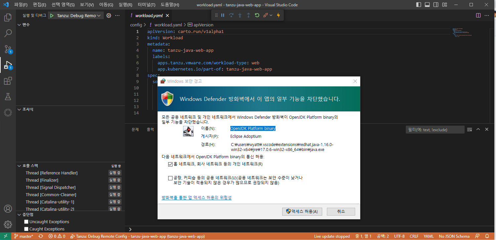

## 동적 배포와 원격 디버깅
여기서는 간단한 guide만 설명하고 있습니다. 자세한 내용은 아래의 주소에서 확인할 수 있습니다.

https://docs.vmware.com/en/VMware-Tanzu-Application-Platform/1.2/tap/GUID-vscode-extension-using-the-extension.html


### 1. IDE에서 앱 배포하기
1. 소스 download
    로컬 경로에 자신의 github.com 에 올려져 있는 tanzu-java-web-app을 git clone을 통해 소스를 다운로드 합니다.
    ```
    예:)    git clone https://github.com/wonjoyoo/tanzu-java-web-app
    ```
2. Visual Studio Code 에 '폴더 열기' 메뉴를 클릭하여 위에서 다운로드 받은 폴더를 엽니다.
3. 파일 내용 확인 및 수정
    ```
    .mvn/wrapper/maven-wrapper.properties
    ```
    위 파일을 열고 3번째 줄이 빈줄로 있는 경우 3번째 줄을 없앱니다.

3. workload 실행
    

4. app 확인
    app이 deploy가 되게 되면 아래의 형식으로 배포가 되게 됩니다.

    ```
        tanzu-java-web-app.네임스페이스.도메인명 
    ```

    브라우저에서 정상적으로 생성이 되었는지 확인을 해봅니다.

### 2. 동적 배포와 원격 디버깅
4. Live Update

    Live Update 기능을 시작합니다. 이때는 App을 새로 배포를 진행하게 됩니다.
        
    페이지가 정상적으로 열리는지 확인합니다.
    소스를 수정하고 변경사항이 바로 적용이 되는지 확인합니다. 보통 10초 이내에 반영이 됩니다.

3. 원격 Debug

    원격 클러스터에 배포되어 있는 app을 debug하기 위해서는 먼저 마우스로 소스에 break point를 설정하고 Debug Start 를 시작합니다.
    

    윈도우의 경우 내장 방화벽이 enable되어 있는 경우 아래와 같은 메세지가 나오게 됩니다. 액세스 허용을 누르면 됩니다.
    

    Tilt 파일에 아래와 같은 권한이 필요하다고 나옵니다. 동일하게 내용을 Tilt 파일의 제일 아래부분에 추가시킵니다.
    

    Tilt 파일 수정
    ```
    allow_k8s_contexts('cluster1-admin@cluster1')
    ```
    
    다시 호출해서 workload가 Ready가 되면 페이지를 호출합니다. 페이지가 정상적으로 열리지 않고 pending상태가 되어 있는 것을 확인할 수 있습니다.
    
    VS Code에서 Resume기능이나 한 Step 이동하는 기능으로 Debug를 확인합니다.
    
    

