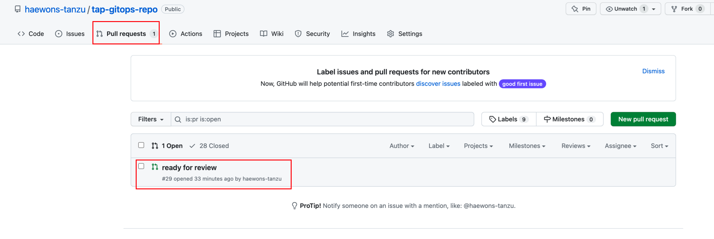
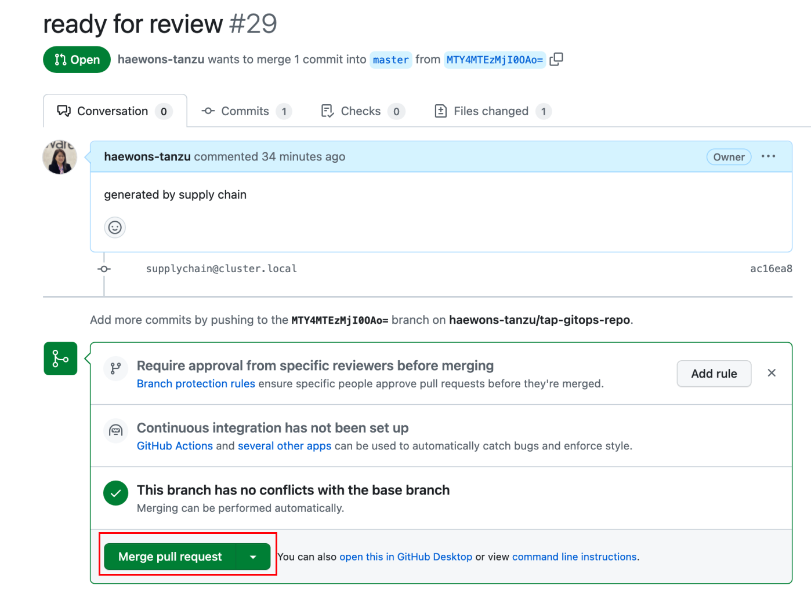
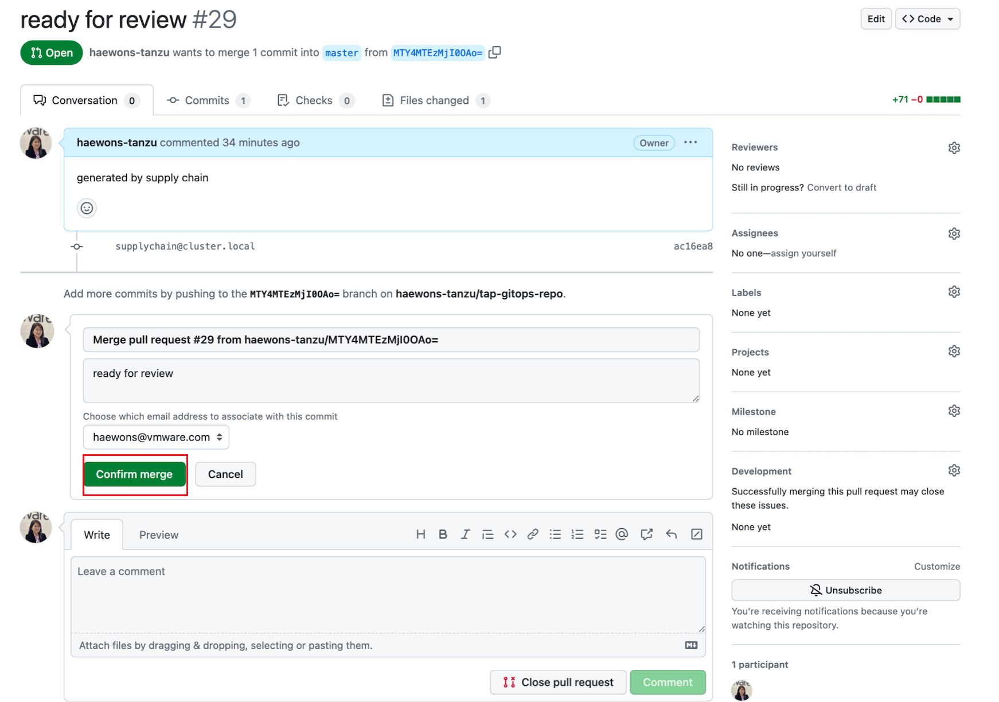
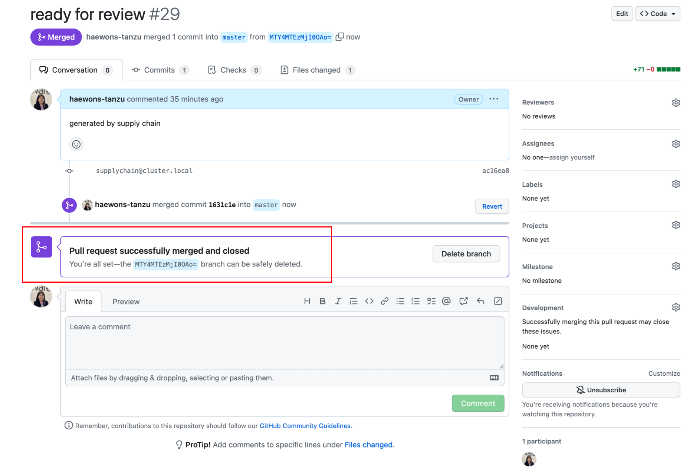
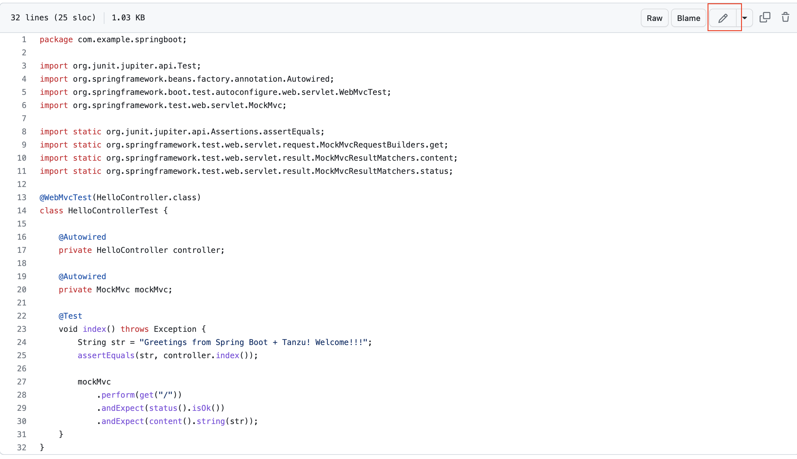
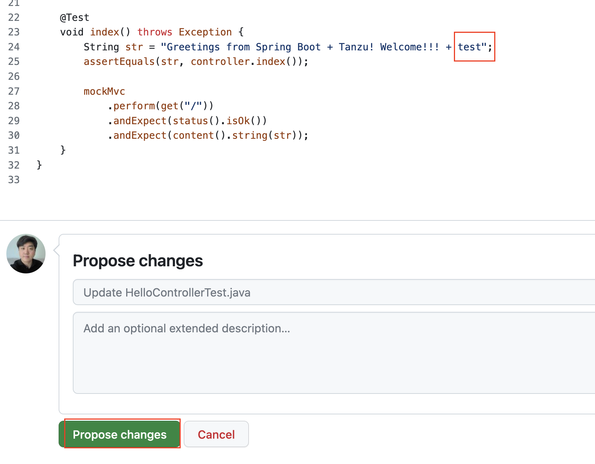

# GitOps

본 과정에서는 GitOps 접근 방식을 사용하여 Kubernetes 구성을 원격 Git 저장소로 푸시하도록 Supply Chain을 설정합니다.
현 GitOps 테스트는 멀티클러스 환경에서 구성이 되며, 아래 tap-value.yaml 파일은 Build 클러스터 환경에서 수행하여 Run 클러스터에 App이 배포가 되는지 확인합니다. 
해당 실습은 ootb_supply_chain_testing_scanning로 진행합니다.


## 0. contexts 정보를 변경합니다.
### 1) 현재의 Cluster contexts 정보를 조회합니다.
~~~
kubectl config get-contexts
~~~

### 2) 실습자 환경의 build Cluster로 contexts를 변경합니다.
~~~
kubectl config use-context '<NAME>'
kubectl config use-context build-cluster-admin@build-cluster
~~~

## 1. GitOps 적용
### 1) HTTP(S) Basic-auth
구성 정보를 담을 repository가 https:// 또는 http:// 를 사용한다면, Kubernetes 시크릿은 다음과 같이 해당 repository에 대한 credential을 제공해야 합니다. <br/>
다음 Yaml 파일 예시를 참고하여 작성합니다. GIT-USERNAME에는 본인의 github id, GIT-PASSWORD에는 본인의 github 비밀번호 혹은 token 정보를 사용합니다. <br/>

~~~
apiVersion: v1
kind: Secret
metadata:
  name: git-http  # `git-ssh` is the default name.
                        #   - operators can change such default by using the
                        #     `gitops.ssh_secret` property in `tap-values.yaml`
                        #   - developers can override by using the workload parameter
                        #     named `gitops_ssh_secret`.
  annotations:
    tekton.dev/git-0: https://github.com        # ! required
type: kubernetes.io/basic-auth          # ! required
stringData:
  username: GIT-USERNAME
  password: GIT-PASSWORD
~~~

작성 완료 후 해당 파일을 적용합니다.

~~~
kubectl apply -f gitops-http-auth.yaml
~~~

### 2) ServiceAccount 작성
secret 생성 이후에는 workload에서 사용하는 serviceaccount와 붙이는 과정이 필요합니다. 다음 yaml 파일을 적용합니다.
~~~
apiVersion: v1
kind: ServiceAccount
metadata:
  name: default
secrets:
  - name: registry-credentials
  - name: tap-registry
  - name: git-http
imagePullSecrets:
  - name: registry-credentials
  - name: tap-registry
~~~

### 3) tap-values.yaml 파일 수정
tap-values.yaml의 ootb_supply_chain 항목을 다음과 같이 수정합니다. <br/>
GIT-USERNAME에는 본인의 github 계정 정보를 입력하며, 이때 본인의 계정 아래에 tanzu-java-web-app 이라는 Repository 있는지 확인하고 진행합니다.
~~~
supply_chain: testing_scanning
ootb_supply_chain_testing_scanning: # Optional if the corresponding shared keys are provided.
  registry:
    server: "your-image-repo-url"
    repository: "tanzu-application-platform/supply-chain"
  gitops:
    server_address: https://github.com/
    repository_owner: <your-git-repository-owner> #tanzukorea 
    repository_name: <your-git-repository_name>   #tap-gitops
    branch: main
    ssh_secret: git-http  # 1에서 만든 HTTP(S) Basic-auth 기반의 Secret 
    commit_strategy: pull_request
    pull_request:
      server_kind: github
      commit_branch: ""
      pull_request_title: ready for review
      pull_request_body: generated by supply chain
 ~~~
다음으로 수정된 profile을 업데이트합니다.

~~~
tanzu package installed update tap -p tap.tanzu.vmware.com -v 1.4.2 --values-file tap-build-values.yaml -n tap-install
~~~

### 4) 애플리케이션 배포
#### 1) 다음과 같은 workload.yaml 파일을 생성합니다. <br/>

~~~
apiVersion: carto.run/v1alpha1
kind: Workload
metadata:
  name: tanzu-java-web-app-test
  labels:
    app.kubernetes.io/part-of: tanzu-java-web-app-test
    apps.tanzu.vmware.com/workload-type: web
    apps.tanzu.vmware.com/has-tests: "true"
    #metric = concurrency
spec:
  params:
  - name: testing_pipeline_matching_labels
    value:
      apps.tanzu.vmware.com/pipeline: test
      apps.tanzu.vmware.com/language: java
  source:
    git:
      ref:
        branch: master
      url: https://github.com/haewons-tanzu/tanzu-java-web-app
~~~

#### 2) 아래와 같이 kubectl 명령어로 수행을 하거나, <br/>
~~~
kubectl apply -f workload.yaml -n {namespace}
~~~

아래와 같이 tanzu cli로 workload를 생성 할 수 있습니다.
~~~
tanzu apps workload apply -f tanzu-java-web-app-stg.yaml -n {namespace}
🔎 Create workload:
      1 + |---
      2 + |apiVersion: carto.run/v1alpha1
      3 + |kind: Workload
      4 + |metadata:
      5 + |  labels:
      6 + |    app.kubernetes.io/part-of: tanzu-java-web-app-test
      7 + |    apps.tanzu.vmware.com/workload-type: web
      8 + |  name: tanzu-java-web-app-test
      9 + |  namespace: dev-team-01
     10 + |spec:
     11 + |  params:
     12 + |  - name: testing_pipeline_matching_labels
     13 + |    value:
     14 + |      apps.tanzu.vmware.com/language: java
     15 + |      apps.tanzu.vmware.com/pipeline: test
     16 + |  source:
     17 + |    git:
     18 + |      ref:
     19 + |        branch: main
     20 + |      url: https://github.com/haewons-tanzu/tanzu-java-web-app
❓ Do you want to create this workload? [yN]: y
~~~


#### 3) 배포되고 있는 workload 로그를 확인합니다. <br/>
~~~
tanzu apps workload tail tanzu-java-web-app-test --namespace dev-team-01 --timestamp --since 1h
~~~

아래와 같은 로그를 확인 할 수 있습니다.


#### 4) build 클러스터에서 아래와 같은 명령어를 이용하여, "workload-name-deliverable" ex)tanzu-java-web-app-test-deliverable의 configmap을 조회합니다. <br/>
~~~
kubectl get configmap tanzu-java-web-app-test-deliverable --namespace dev-team-01 -o go-template='{{.data.deliverable}}'

apiVersion: carto.run/v1alpha1
kind: Deliverable
metadata:
  name: tanzu-java-web-app-test
  labels:
    app.kubernetes.io/part-of: tanzu-java-web-app-test
    apps.tanzu.vmware.com/has-tests: "true"
    apps.tanzu.vmware.com/workload-type: web
    app.kubernetes.io/component: deliverable
    app.tanzu.vmware.com/deliverable-type: web
    carto.run/cluster-template-name: external-deliverable-template
    carto.run/resource-name: deliverable
    carto.run/supply-chain-name: source-test-scan-to-url
    carto.run/template-kind: ClusterTemplate
    carto.run/template-lifecycle: mutable
    carto.run/workload-name: tanzu-java-web-app-test
    carto.run/workload-namespace: dev-team-01
spec:
  params:
  - name: gitops_ssh_secret
    value: git-creds
  source:
    git:
      url: https://github.com/haewons-tanzu/tap-gitops-repo.git
      ref:
        branch: master
    subPath: config/dev-team-01/tanzu-java-web-app-test
~~~


#### 5) Deliverable 아래와 같이 저장합니다. <br/>

```cmd
kubectl get configmap tanzu-java-web-app-test-deliverable --namespace dev-team-01 -o go-template='{{.data.deliverable}}' >  deliverable.yaml
```


#### 6) 아래와 같이 위 workload을 배포 할 run 클러스터로 context을 변경합니다. <br/>
~~~
kubectl config use-context run-cluster-admin@run-cluster
Switched to context "run-cluster-admin@run-cluster".
~~~

#### 7) run 클러스터에 아래와 같이 deliverable을 apply 합니다. <br/>
~~~
kubectl apply -f deliverable.yaml -n dev-team-01
~~~

- * 5~7의 작업은 최초 workload 배포시 최초 1회만 수행 하면 됩니다. 

#### 8) run 클러스터에서 delicerables을 조회합니다. 아래와 같이 False인것을 확인 합니다. READY False인 이유는, 승인에 요청에 인한 확인이 이루어 지지 않았기 때문입니다. 다음 실습을 통해  pull request 요청을 확인 하고, Merge Pull request 실습을 해보겠습니다. <br/>
~~~
kubectl get deliverables -n dev-team-01
NAME                      SOURCE                                                 DELIVERY         READY   REASON                 AGE
tanzu-java-web-app-test   https://github.com/haewons-tanzu/tap-gitops-repo.git   delivery-basic   False   HealthyConditionRule   48s
~~~

### 5) git 승인 요청 프로세스 수행 <br/>
#### 1) TAP GUI 파이프라인 확인. 아래와 같은 에러가 발생하는 이유는 승인절차가 완료되지 않았기 때문이며, source url을 클릭하여 승인 절차를 진행합니다. <br/>


#### 2) pull request 확인 <br/>


#### 3) merge pull request <br/>


#### 4) merge 승인 <br/>


#### 5) merge 승인 확인 <br/>


### 6) run 클러스터에서 delicerables, httpproxy 조회 <br/>
~~~
kubectl get deliverables,httpproxy -n dev-team-01

NAME                                            SOURCE                                                 DELIVERY         READY   REASON   AGE
deliverable.carto.run/tanzu-java-web-app-test   https://github.com/haewons-tanzu/tap-gitops-repo.git   delivery-basic   True    Ready    119m


NAME                                                                                          FQDN                                                         TLS SECRET                                               STATUS   STATUS DESCRIPTION
httpproxy.projectcontour.io/tanzu-java-web-app-test-contour78179a831912511c61e6e233bdbedd72   tanzu-java-web-app-test-dev-team-01.run.tap.tanzukorea.xyz   dev-team-01/route-933db279-434d-42c1-b1e7-2e96101534e2   valid    Valid HTTPProxy
httpproxy.projectcontour.io/tanzu-java-web-app-test-contouraef609d6cca1b3a330865551acf79e7c   tanzu-java-web-app-test.dev-team-01                          kube-system/tap-wildcard-cert                            valid    Valid HTTPProxy
httpproxy.projectcontour.io/tanzu-java-web-app-test-contourbd0ffc463839f2f4142c90f1bf4b0214   tanzu-java-web-app-test.dev-team-01.svc                      kube-system/tap-wildcard-cert                            valid    Valid HTTPProxy
httpproxy.projectcontour.io/tanzu-java-web-app-test-contoure57f5e178288f40bff602732bf1a0ea4   tanzu-java-web-app-test.dev-team-01.svc.cluster.local        kube-system/tap-wildcard-cert                            valid    Valid HTTPProxy
~~~

### 7) TAP GUI 파이프라인에서 확인 <br/>


### 8) tanzu-java-web-app-test-dev-team-01.run.tap.tanzukorea.xyz 접속 확인  <br/>


### 9) source git 에서 소스 수정 후 변경을 감지하여 GitOps 방식으로 동작하는지 확인 <br/>
#### 1) 각자 자신의 git 에 접속하여 앞의 단계에서 배포한 소스 레포지터리에 접속 후 아래 아이콘을 클릭합니다. <br/>


#### 2) 각자의 소스를 변경 후 저장합니다. <br/>


#### 3) 5번의 "git 요청 프로세스"를 수행하여 merge 승인 확인까지 완료합니다. <br/>

#### 4) run cluster에 배포된  5-6 번의 httpproxy "https://tanzu-java-web-app-test-dev-team-01.run.tap.tanzukorea.xyz" url 접속하여 변경사항이 반영되었는지 확인합니다. 


